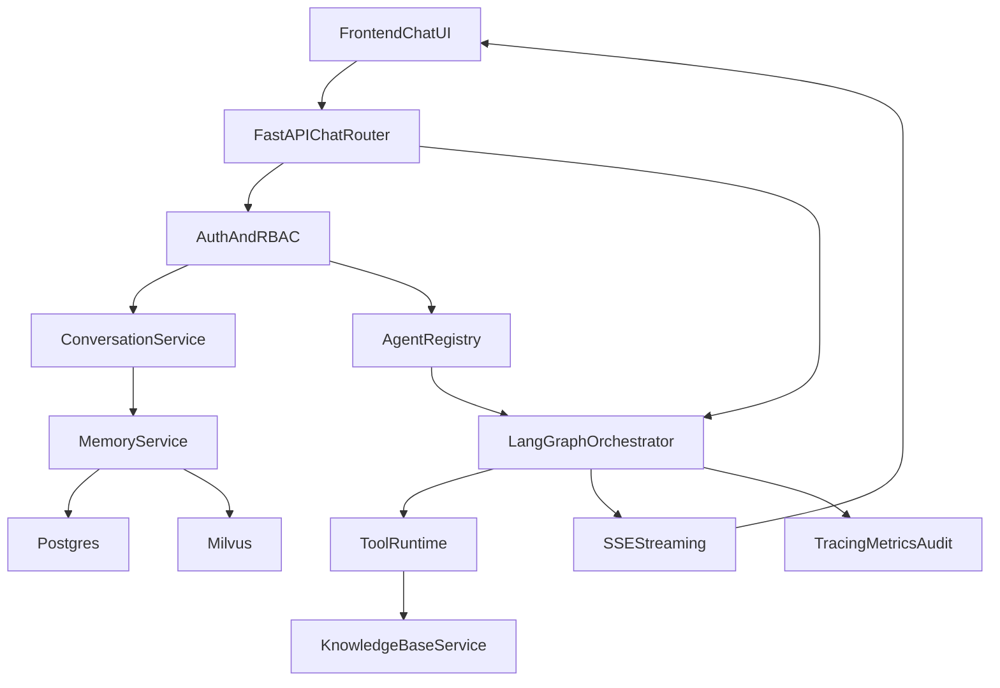

# LangGraph 可插拔 Agent 企业化方案

## 目标与边界

- 以现有 FastAPI + Next.js 架构为基础，升级为 **多用户、可插拔 Agent、可治理** 的企业级聊天平台。
- 第一阶段保证：`agent` 可注册/可选择/可灰度、`conversation` 与 `message` 正式落库、`memory` 可配置、`trace` 可观测。
- 兼容现有 SSE 聊天体验，不破坏当前前端消息流。

## 现状关键点（已确认）

- 聊天主链路在 [backend/app/routers/chat.py](backend/app/routers/chat.py) 与 [backend/app/services/llm.py](backend/app/services/llm.py)，目前是 LLM 直连。
- 会话仍是临时内存方案 [backend/app/routers/conversation.py](backend/app/routers/conversation.py)。
- 前端输入区在 [frontend/components/chat/chat-window.tsx](frontend/components/chat/chat-window.tsx) 与 [frontend/components/chat/chat-input.tsx](frontend/components/chat/chat-input.tsx)，当前没有 Agent 选择。

## 目标架构

## 后端设计（可插拔 + 企业级）

- **Agent 插件层**：新增 `AgentDefinition` 协议与注册中心 `AgentRegistry`，每个 Agent 通过 `id/version/capabilities/entry_graph` 自描述，避免在路由层写 if-else。
- **LangGraph 编排层**：新增 `AgentRuntimeOrchestrator`，按 `agent_id` 加载图并执行；统一输出流式 chunk 事件（token、tool_call、tool_result、done、error）。
- **会话与消息持久化**：将 [backend/app/routers/conversation.py](backend/app/routers/conversation.py) 从内存迁移为数据库服务层；`conversation_id` 成为强约束主键并贯穿全链路。
- **记忆系统分层**：
  - 短期记忆：最近 N 轮上下文（窗口记忆）
  - 中期记忆：对话摘要（summary memory）
  - 长期记忆：向量记忆（Milvus，按 user_id + conversation_id 隔离）
- **多用户企业能力**：JWT 鉴权、RBAC（admin/member）、租户/用户隔离、审计日志、幂等请求键、限流与配额。
- **Agent 治理能力**：Agent 上下线开关、版本策略（default/canary）、可见范围（按角色/租户）、失败回退策略（fallback agent）。

## 认证与 OIDC 技术选型（已确认）

- 采用 **FastAPI 自建 OIDC Provider**（非托管），基于现成 Python 库实现，避免手写底层协议细节。
- OAuth/OIDC 主库：`Authlib`（授权码、token、id_token、userinfo 等能力）。
- JWT/JWS/JWK：使用 `python-jose`（替代 `jwcrypto`）进行签发与验签。
- 密码安全：`passlib[bcrypt]`；配置管理沿用 `pydantic-settings`。
- 需提供标准端点：`/.well-known/openid-configuration`、`/oauth/authorize`、`/oauth/token`、`/oauth/jwks`、`/oauth/userinfo`、`/oauth/revoke`、`/oauth/introspect`（可选启用）。

## 关键接口规划

- **Agent 目录与配置**
  - `GET /api/agents`：返回当前用户可见 Agent 列表（含能力标签）
  - `GET /api/agents/{id}`：返回 Agent 元数据、参数 schema、支持工具
- **聊天接口升级**（兼容现有 [backend/app/models/schemas.py](backend/app/models/schemas.py)）
  - `POST /api/chat` 新增字段：`agent_id`、`memory_mode`、`conversation_id`（必填或自动创建返回）
  - SSE 事件扩展：`token`、`tool_call`、`tool_result`、`trace`、`done`
- **会话接口企业化**
  - `POST /api/conversations`（带 `agent_id` 初始化）
  - `GET /api/conversations`（分页/搜索/按更新时间排序）
  - `GET /api/conversations/{id}/messages`（分页游标）

## 数据模型（新增核心表）

- `users` / `tenants` / `memberships`
- `agents`（注册元数据、状态、版本）
- `conversations`（tenant_id, user_id, agent_id, title, memory_mode）
- `messages`（role, content, tool_events, citations, token_usage）
- `conversation_memories`（summary、salient_facts、embedding_ref）
- `agent_runs`（trace_id、status、latency、error_code）
- `audit_logs`（actor、action、resource、diff）

## 权限模型与检索隔离设计（新增）

- **权限模型采用 RBAC + 资源 ACL（可扩展 ABAC）**
  - RBAC：角色级权限（`owner/admin/editor/viewer/guest`）
  - ACL：资源级授权（知识库级、文档级、chunk 级）
  - 预留 ABAC 字段（department、project、classification）供后续策略引擎扩展
- **数值权限等级（最终）**
  - 采用 `0-999` 作为统一权限等级范围（上限 `999`）。
  - 用户字段：`users.permission_level`（默认 `500`，中间值）。
  - 资源字段：`required_level`（知识库/文档/chunk 均可配置）。
  - 核心判定：`user.permission_level >= resource.required_level`。
- **数据库新增表**
  - `roles`（角色定义）
  - `permissions`（动作定义：`kb:read`、`kb:write`、`chunk:read` 等）
  - `role_permissions`（角色与权限映射）
  - `user_roles`（用户在租户内的角色）
  - `resource_acl`（`resource_type/resource_id/principal_type/principal_id/effect`）
  - `kb_documents` 新增：`required_level`, `owner_user_id`, `visibility_scope`
  - `kb_chunks` 新增：`required_level`, `allowed_roles`, `allowed_users`, `tenant_id`, `kb_id`, `doc_id`
- **授权决策顺序**
  - 先做租户隔离（`tenant_id` 必须一致）
  - 再做角色校验（RBAC）
  - 再做资源 ACL 覆盖（deny 优先）
  - 最后做数值权限校验（`required_level <= user.permission_level` 或白名单）

## 前端交互设计（Agent 选择）

- **位置结论**：Agent Select 放在输入框“上方一行”比“输入框下方”更合适。
  - 原因：发送前可见、语义更接近“本轮/本会话策略”、不挤占输入操作区。
  - 在当前结构中，放在 [frontend/components/chat/chat-window.tsx](frontend/components/chat/chat-window.tsx) 的 `<ChatInput />` 上方一行最稳定。
- **状态绑定策略**：`selectedAgentId` 绑定到会话级别（不是全局），切换会话自动切换 Agent。
- **接口改造点**：
  - [frontend/types/chat.ts](frontend/types/chat.ts) 为 `ChatRequest` 增加 `agent_id`、`memory_mode`
  - [frontend/lib/api.ts](frontend/lib/api.ts) 的 `sendChatMessage` 透传 `conversation_id + agent_id`
  - 新增 `AgentSelector` 组件，并注入 `ChatWindow`。

## 登录与会话体验（已确认）

- **登录页必须建设**：未登录访问聊天与知识库页面时，统一跳转 `/login`。
- **视觉要求**：采用“高视觉冲击”方案（复杂动画背景 + 沉浸式动效），优先品牌展示。
- **页面能力**：
  - 登录页 `/login`
  - 无权限页 `/403`
  - 会话失效页或统一拦截跳转（401 自动回登录）
  - 右上角用户信息卡（用户名、租户、权限值如 `Lv.500`）
- **前端建议依赖（按需）**：
  - `framer-motion`（交互动效）
  - `react-three-fiber` + `@react-three/drei`（3D 背景）
  - `lottie-react`（品牌动画，可选）
  - 注意提供 `reduce-motion` 降级策略，避免低性能设备卡顿

## Redis 集成（已确认）

- 启用 Redis 作为认证与安全基础设施，不仅用于缓存：
  - `refresh_token` 存储与轮换
  - `access_token` 黑名单（登出/封禁即时生效）
  - 登录失败计数与限流（防爆破）
  - 权限快照短 TTL 缓存（如 30-60 秒）
- 推荐接入位置：
  - 新增 `backend/app/services/session_store.py`
  - 新增 `backend/app/services/token_service.py`
  - 在鉴权依赖中统一读取与校验 Redis 状态

## 主要改造文件（优先）

- 后端入口与路由：
  - [backend/app/routers/chat.py](backend/app/routers/chat.py)
  - [backend/app/routers/conversation.py](backend/app/routers/conversation.py)
  - [backend/app/models/schemas.py](backend/app/models/schemas.py)
- 后端新增服务（建议新增文件）：
  - `backend/app/services/agent_registry.py`
  - `backend/app/services/agent_runtime.py`
  - `backend/app/services/memory_service.py`
  - `backend/app/services/conversation_service.py`
  - `backend/app/services/auth_service.py`
- 前端：
  - [frontend/components/chat/chat-window.tsx](frontend/components/chat/chat-window.tsx)
  - [frontend/components/chat/chat-input.tsx](frontend/components/chat/chat-input.tsx)
  - [frontend/lib/api.ts](frontend/lib/api.ts)
  - [frontend/types/chat.ts](frontend/types/chat.ts)

## 分阶段交付

- **Phase 1（基础可用）**：AgentRegistry + LangGraphOrchestrator + conversation/message 落库 + 前端 Agent 选择 + `/api/agents`。
- **Phase 2（企业增强）**：JWT/RBAC、多租户隔离、摘要记忆+向量记忆、审计日志、速率限制、Redis 会话治理、登录页与鉴权路由守卫。
- **Phase 2.5（权限检索增强）**：知识库权限模型（RBAC+ACL）落库，Milvus 检索接入权限过滤（库级/文档级/chunk 级）。
- **Phase 3（平台治理）**：Agent 版本治理、灰度发布、回放与追踪面板、策略编排与 SLA 告警。

## Milvus 权限过滤方案（库级 + Chunk 级）

- **写入阶段（Ingestion）**
  - 每个 chunk 写入 Milvus 时附带元数据：`tenant_id`, `kb_id`, `doc_id`, `chunk_id`, `required_level`, `allowed_roles`, `allowed_users`, `is_enabled`
  - 元数据来源于 Postgres 中 `kb_documents/kb_chunks/resource_acl` 的计算结果
- **检索阶段（Retrieval）**
  - 检索前先从 Postgres 计算当前用户的 `effective_access`（角色、白名单、permission_level）
  - 构建 Milvus filter 表达式（示例维度）：
    - `tenant_id == currentTenant`
    - `kb_id in accessibleKbIds`
    - `is_enabled == true`
    - `required_level <= user_permission_level`
    - `allowed_roles contains any(user_roles) OR allowed_users contains user_id`
  - 向量召回后再做一次后置权限复核（防止索引/缓存导致越权）
- **性能与正确性**
  - 采用“两阶段过滤”：先粗过滤（tenant/kb/enabled），后精过滤（ACL/classification）
  - 高频用户权限可做短 TTL 缓存（如 30-60s），权限变更触发失效
  - 严格执行 `deny` 优先与审计记录（记录被过滤 chunk 数）
- **审计与可观测**
  - 每次检索落 `agent_runs` 扩展字段：`retrieved_count`, `filtered_count`, `denied_count`, `policy_version`
  - 审计日志记录：用户、会话、agent、知识库、命中密级分布

## 验收标准（简化）

- 用户可创建会话并选择 Agent，消息全量落库且可恢复。
- 新增一个 Agent 只需“注册 + 实现图”，不改聊天路由主逻辑。
- 单次对话可输出工具调用事件与追踪 ID。
- 权限隔离生效：用户仅可见自己租户与授权 Agent。
- 知识检索权限生效：无权限用户无法召回对应知识库/文档/chunk，且有审计记录可追溯。

